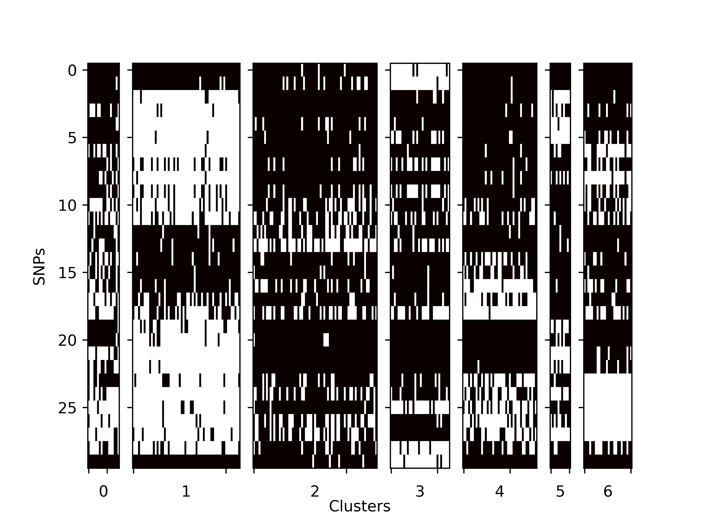
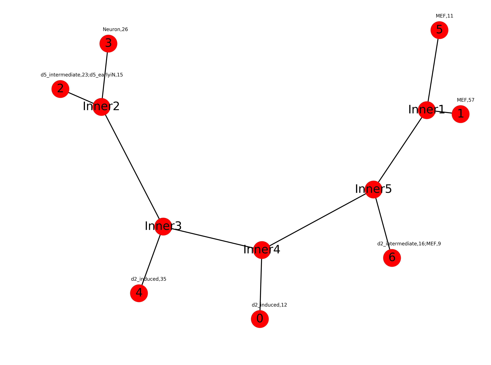

 TBSP: <span style="color:red"> T</span>rajectory Inference <span style="color:red">B</span>ased on <span style="color:red">S</span>N<span style="color:red">P</span> information.  
[](https://opensource.org/licenses/MIT)    


# INTRODUCTION 
<div style="text-align: justify"> 
Several recent studies focus on the inference of developmental and response trajectories from single cell RNA-Seq (scRNA-Seq) data. A number of computational methods, 
often referred to as pseudo-time ordering, have been developed for this task. 
Recently, CRISPR has also been used to reconstruct lineage trees by inserting random mutations. 
However, both approaches suffer from drawbacks that limit their use. Here we develop a method to detect significant, cell type specific, 
sequence mutations from scRNA-Seq data. We show that only a few mutations are enough for reconstructing good branching models. 
Integrating these mutations with expression data further improves the accuracy of the reconstructed models. 

</div>  


# PREREQUISITES

* python (python 2 and python 3 are both supported)  
It was installed by default for most Linux distribution and MAC.  
If not, please check [https://www.python.org/downloads/](https://www.python.org/downloads/) for installation 
instructions. 

* Python packages dependencies:  
-- scikit-learn   
-- scipy  
-- numpy  
-- matplotlib  
-- networkx 
-- pyBigWig
-- Biopython

The python setup.py script (or pip) will try to install these packages automatically.
However, please install them manually if, by any reason, the automatic 
installation fails. 

# INSTALLATION
 
 There are 3 options to install scdiff.  
* __Option 1: Install from download directory__   
	cd to the downloaded scdiff package root directory

	```shell
	$cd tbsp
	```
	run python setup to install   

	```shell
	$python setup.py install
	```
		
	MacOS or Linux users might need the sudo/root access to install. 
	Users without the root access can install the package using the pip/easy_install with a --user parameter ([install python libraries without root](https://stackoverflow.com/questions/7465445/how-to-install-python-modules-without-root-access))．
	 
	```shell  
	$sudo python setup.py install 
	```
	use python3 instead of python in the above commands to install if using python3. 
	
* __Option 2: Install from Github__:    

	python 2:  
	```shell
	$sudo pip install --upgrade https://github.com/phoenixding/tbsp/zipball/master
	```
	python 3: 
	```shell
	$sudo pip3 install --upgrade https://github.com/phoenixding/tbsp/zipball/master
	```


The above pip installation options should be working for Linux, Window and MacOS systems.   
For MacOS users, it's recommended to use python3 installation. The default python2 in MacOS has
some compatibility issues with a few dependent libraries. The users would have to install their own
version of python2 (e.g. via [Anocanda](https://anaconda.org/)) if they prefer to use python2 in MacOS.  

# USAGE

```shell
usage: tbsp [-h] -i IVCF [-b [IBW]] [-l [CELL_LABEL]] -o OUTPUT [--cutl CUTL]
            [--cuth CUTH]

optional arguments:
  -h, --help            show this help message and exit
  -i IVCF, --ivcf IVCF  Required,directory with all input .vcf files. This
                        specifies the directory of SNP files (.vcf) for the
                        cells (one .vcf file for each cell). These .vcf files
                        can be obtained using the provided bam2vcf script or
                        other RNA-seq variant calling pipelines preferred by
                        the users.
  -b [IBW], --ibw [IBW]
                        Optional,directory with all input bigwig (.bw) files
                        with the information about the number of aligned reads
                        at each genomic position. These bigwig files are used
                        to filter the SNPs, which are redundant to expression
                        information.
  -l [CELL_LABEL], --cell_label [CELL_LABEL]
                        Optional, labels for the cells. This is used only to
                        annotate the cells with known information, not used
                        for building the model.
  -o OUTPUT, --output OUTPUT
                        Required,output directory
  --cutl CUTL           Optional, lower bound cutoff to remove potential false
                        positive SNPs,default=0.1
  --cuth CUTH           Optional, upper bound cutoff to remove baseline SNPs,
                        which are common in most cells, default=0.8

                        
```
# INPUTS AND PRE-PROCESSINGS


* __-i__:    
Required input, this specifies the directory of all SNP(.vcf) files. We recommend using [GATK RNA-seq variant calling pipeline](https://software.broadinstitute.org/gatk/documentation/article.php?id=3891) to call the vcfs from .bam (mapped reads) files. 
Users are also allowed to use the SNPs (.vcfs) identified by programs of their preferences.  

* __-b__:  
Optional input, this specifies the directory of all bigwig (.bw) files. We provided the script [bam2bw.py](./bam2bw/bam2bw.py) under [bam2bw](./bam2bw) directory to convert the bam files to bigwig files. This files are
used to filter SNPs, potentially redundant to expression. 

* __-l__:  
Optional input, this species the labels for the cells. 
File format (tab-delimited):  
```
cell1	label1
cell2	label2
```
These cell labels are only used to annotate the cells in the trajectory.

# OUTPUTS


* __GroupCells.txt__:  
A text file, which describes the cells in each cluster.

	Format:
	```
	Cell_ID	Cluster_ID
	SRR1931024	cluter:0
	SRR1930999	cluter:0
	SRR1930977	cluter:0
	SRR1931041	cluter:0
	SRR1931012	cluter:0
	SRR1930945	cluter:0
	SRR1931003	cluter:0
	SRR1931002	cluter:0
	SRR1931004	cluter:0
	..
	```

* __SNP_matrix.tsv__:   
The SNP matrix for all the cells. 
Row: SNPs
Column: Cells
Value: Binary (0/1), which indicates whther the SNP is included in the cell. 

* __SNP_matrix.jpg__:   
The SNP matrix in jpg image. 

* __Trajectory.dat__:    

	```
	4	(-0.6168642633606496, -0.29504774213348317)
	Inner4	(-0.01784069226314263, -0.19237987266625067)
	2	(-1.0, 0.1907479586411944)
	Inner5	(0.526511663382742, -0.048432121394020027)
	6	(0.6167190582080249, -0.21090119687699874)
	0	(-0.02807716265846153, -0.3564777531262085)
	3	(-0.7661682030072015, 0.29873283057457906)
	Inner3	(-0.4986251141938113, -0.13657170781011707)
	Inner1	(0.785885623794461, 0.14046537917538365)
	5	(0.8477737598817315, 0.3307492805568145)
	1	(0.9509945159224894, 0.1308847244003101)
	Inner2	(-0.8003091857061821, 0.14823022065879607)
	```
	First column: cluster id  
	second column: coordinates  

* __Trajectory.jpg__:     
Graph representation of Trajectory.dat 


# EXAMPLES

* __Example inputs__:  
We provided example vcf files under [examples](./examples/vcf_example) folder. 
To run tbsp on the example data:
```
$tbsp -i examples/vcf_example -o example_out
```

* __Example outputs__:  
Example output files can be found under [examples](./examples/output_example) folder.

# CREDITS
 
This software was developed by ZIV-system biology group @ Carnegie Mellon University.  
Implemented by Jun Ding.


# LICENSE 
 
This software is under MIT license.  


# CONTACT

zivbj at cs.cmu.edu  
jund  at cs.cmu.edu


                                 
                                 
                                 
                                 
                                 

                                                     
